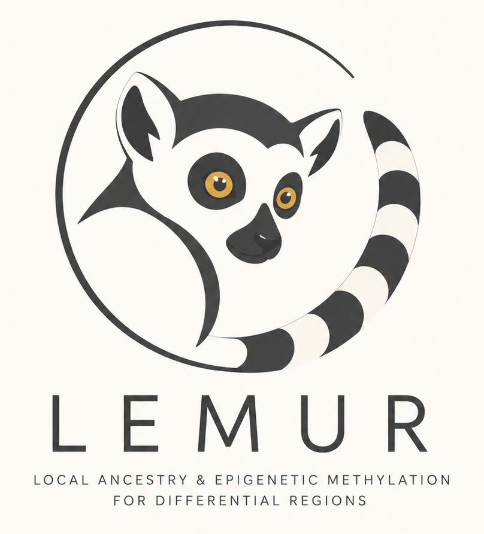

# LEMUR
### Local ancestry & Epigenetic Methylation for differential Regions

<p align="center">
  
</p>

Stream-merge [modkit](https://github.com/nanoporetech/modkit) **bedMethyl** files from phased haplotypes into a single TSV matrix, with optional local beta-binomial imputation. Built for cohorts where each sample has `*_hp1.bedmethyl` and `*_hp2.bedmethyl` pairs.

Five command-line tools:

| Tool | Purpose |
|------|---------|
| `merge_bedmethyl` | Merge haplotype bedMethyl pairs into one TSV |
| `impute_methylation` | Impute missing methylation on an already-merged TSV |
| `evaluate` | Hold-out benchmark for imputation (per-sample or per-haplotype) |
| `dml` | DSS DML multiFactor: differential methylation per CpG |
| `call_dmr` | DSS callDMR: merge significant DML sites into DMRs |

## Output format (merge)

Tab-separated values (TSV). The first two columns are shared across all samples:

| Column | Description |
|--------|-------------|
| `chr` | Chromosome |
| `pos` | Start position (bedMethyl start, 0-based) |

For each sample label `{id}` given on the command line, columns are appended **in this order**:

#### Haplotype mode (default)

Six columns per sample:

| Column | Source (bedMethyl) | Description |
|--------|-------------------|-------------|
| `{id}.hap1_counts` | `N_modified` (haplotype 1) | Methylated read count |
| `{id}.hap2_counts` | `N_modified` (haplotype 2) | Methylated read count |
| `{id}.hap1_cov` | valid coverage (haplotype 1) | Coverage at the locus |
| `{id}.hap2_cov` | valid coverage (haplotype 2) | Coverage at the locus |
| `{id}.hap1_percentage` | `percent_modified` (haplotype 1) | Methylation 0–100 |
| `{id}.hap2_percentage` | `percent_modified` (haplotype 2) | Methylation 0–100 |

#### Sample mode (`--sample`)

Input: `<label> <bedmethyl>` per sample (e.g. modkit `*_combined.bedmethyl`).

Three columns per sample:

| Column | Description |
|--------|-------------|
| `{id}.counts` | Methylated read count |
| `{id}.cov` | Coverage at the locus |
| `{id}.percentage` | Methylation 0–100 |

With two samples `S1` and `S2`, the header is:

```
chr	pos	S1.hap1_counts	S1.hap2_counts	S1.hap1_cov	S1.hap2_cov	S1.hap1_percentage	S1.hap2_percentage	S2.hap1_counts	S2.hap2_counts	S2.hap1_cov	S2.hap2_cov	S2.hap1_percentage	S2.hap2_percentage
```

Example data row (from the test fixtures, `-c 3 -s 2`):

```
chr1	100	2	5	5	5	50	100	3	3	4	6	75	50
```

Meaning at `chr1:100`:

- **S1**: hap1 → 2 methylated reads, cov 5, 50%; hap2 → 5 reads, cov 5, 100%
- **S2**: hap1 → 3 reads, cov 4, 75%; hap2 → 3 reads, cov 6, 50%

### Missing values

If a haplotype has no row at the locus, or its coverage does not pass `-c` (coverage must be **>** N), all six fields for that haplotype are written as `.` (e.g. `.\t.\t.\t.\t.\t.` for both haplotypes of one sample).

A row is emitted only when at least `-s` samples have data at that locus (at least one haplotype per sample above the coverage threshold).

### Percentage formatting

Values come from bedMethyl `percent_modified` (0–100). `0` and `100` are written without decimals; other values drop trailing zeros (e.g. `75`, `50`, `12.5`).

## Output format (imputed)

After imputation (`--impute` on `merge_bedmethyl`, or `impute_methylation`), the merge columns are replaced by imputed columns. Two output modes are available:

#### Fraction mode (default)

Imputes methylation fraction with a local beta-binomial model.

**Haplotype mode (default)**

| Column | Description |
|--------|-------------|
| `{id}.hap1_frac_imputed` | Imputed methylation fraction for haplotype 1 (0–1) |
| `{id}.hap2_frac_imputed` | Imputed methylation fraction for haplotype 2 (0–1) |

**Sample mode (`--sample`)**

| Column | Description |
|--------|-------------|
| `{id}.frac_imputed` | Imputed methylation fraction for the sample (0–1) |

#### Counts/coverage mode (`--counts-cov`)

Imputes methylated read count and coverage. Fraction is estimated with the same beta-binomial model; coverage is the mean of valid neighbors in the window; counts = round(fraction × coverage).

**Haplotype mode (default)**

| Column | Description |
|--------|-------------|
| `{id}.hap1_counts` | Imputed methylated read count (haplotype 1) |
| `{id}.hap1_cov` | Imputed coverage (haplotype 1) |
| `{id}.hap2_counts` | Imputed methylated read count (haplotype 2) |
| `{id}.hap2_cov` | Imputed coverage (haplotype 2) |

**Sample mode (`--sample`)**

| Column | Description |
|--------|-------------|
| `{id}.counts` | Imputed methylated read count |
| `{id}.cov` | Imputed coverage |

Example header and rows (from `tests/expected/tiny_hap1_imputed.tsv`):

```
chr	pos	S1.hap1_frac_imputed	S1.hap2_frac_imputed
chr1	100	0.4	1
chr1	120	0.25	0
chr1	140	0.5	0.4
```

### Imputation logic

- **Beta-binomial model** with configurable prior (`-a`, `-b`; default uniform 1, 1).
- **Local window** (`-w`, default 200 bp, same chromosome): uses neighboring sites with valid counts/coverage.
- **Minimum neighbors** (`-n`, default 5): imputation runs only when enough valid neighbors exist in the window.
- **Fallback**: if neighbors are insufficient but the site has coverage, writes observed values (fraction, or counts/cov in `--counts-cov` mode); otherwise `.`.
- **Fraction formatting**: `0` and `1` without decimals; other values up to 4 decimal places with trailing zeros stripped (e.g. `0.3333`, `0.425`).

Imputation streams line by line; memory scales with window size × number of haplotype columns, not file size. Use `-j N` to process samples in parallel (OpenMP); each sample’s hap1/hap2 windows are independent.

## Requirements

- C++17 compiler (g++ ≥ 7, clang ≥ 5)
- CMake ≥ 3.14
- OpenMP (optional; enables parallel imputation with `-j`)

## Build

```bash
cmake -B build -DCMAKE_BUILD_TYPE=Release
cmake --build build
# or
make
```

Binaries: `build/merge_bedmethyl`, `build/impute_methylation`, `build/evaluate`, `build/dml`, `build/call_dmr`

```bash
cmake --install build   # optional, installs to CMAKE_INSTALL_PREFIX/bin
```

## Usage

### `merge_bedmethyl`

```bash
merge_bedmethyl [-c N] [-s M] [--sample] [--impute] [-w BP] [-a A] [-b B] [-n N] [-j N] \
  <output.tsv> <label1> <hp1> <hp2> [<label2> <hp3> <hp4> ...]
```

Haplotype input (default): three arguments per sample (`label`, `hp1`, `hp2`).

Sample input (`--sample`): two arguments per sample (`label`, `bedmethyl`):

```bash
merge_bedmethyl --sample -c 3 -s 1 merged.tsv \
  S1 results/modkit/S1.bed/S1_combined.bedmethyl \
  S2 results/modkit/S2.bed/S2_combined.bedmethyl
```

| Option | Description | Default |
|--------|-------------|---------|
| `-c`, `--min-cov N` | Include fields only if valid coverage (column 9) **>** N | `3` |
| `-s`, `--min-samples M` | Minimum samples with data per row | `N-1` (N = number of samples) |
| `--sample` | One bedmethyl file per sample (`id file` pairs); output sample columns | off (haplotype) |
| `--impute` | After merge, run beta-binomial imputation (see [Output format (imputed)](#output-format-imputed)) | off |
| `--counts-cov` | With `--impute`: impute counts and coverage instead of fraction | off |
| `-w` | Imputation genomic window (bp, same chromosome) | `200` |
| `-a`, `-b` | Beta-binomial prior α and β | `1`, `1` |
| `-n` | Minimum valid neighbors in window to impute | `5` |
| `-j` | Parallel imputation by sample (`0` = all cores) | `1` |
| `-h`, `--help` | Show help | |

With `--impute`, merge writes a temporary TSV internally, imputes all sample haplotypes, and writes the final imputed matrix to `<output.tsv>`.

#### Example

```bash
./build/merge_bedmethyl merged.tsv \
  CHI01 results/modkit/CHI01.bed/CHI01_hp1.bedmethyl results/modkit/CHI01.bed/CHI01_hp2.bedmethyl \
  CHI02 results/modkit/CHI02.bed/CHI02_hp1.bedmethyl results/modkit/CHI02.bed/CHI02_hp2.bedmethyl
```

Require all samples at each site:

```bash
./build/merge_bedmethyl -s 2 -c 3 merged.tsv CHI01 ... CHI02 ...
```

Merge and impute in one step:

```bash
./build/merge_bedmethyl --impute -w 200 -n 5 -j 4 imputed.tsv \
  CHI01 results/modkit/CHI01.bed/CHI01_hp1.bedmethyl results/modkit/CHI01.bed/CHI01_hp2.bedmethyl \
  CHI02 results/modkit/CHI02.bed/CHI02_hp1.bedmethyl results/modkit/CHI02.bed/CHI02_hp2.bedmethyl
```

### `impute_methylation`

Local **beta-binomial imputation** on an already-merged TSV.

```bash
# Haplotype mode (default): phased hp1/hp2 columns per sample
impute_methylation [-w 200] [-a 1] [-b 1] [-n 5] [-j N] merged.tsv imputed.tsv

# Sample mode: {id}.counts / {id}.cov columns
impute_methylation --sample [-w 200] [-a 1] [-b 1] [-n 5] [-j N] merged.tsv imputed.tsv

# Counts/coverage output
impute_methylation --counts-cov merged.tsv imputed_counts_cov.tsv
```

| Option | Description | Default |
|--------|-------------|---------|
| `--sample` | Input has `{id}.counts` / `{id}.cov` columns | off (haplotype) |
| `--counts-cov` | Impute counts and coverage instead of fraction | off |
| `-w`, `-a`, `-b`, `-n`, `-j` | Same as merge `--impute` options | `200`, `1`, `1`, `5`, `1` |

Haplotype mode (default) writes `{id}.hap{1,2}_frac_imputed` (or `{id}.hap{1,2}_counts` / `_cov` with `--counts-cov`).
Sample mode (`--sample`) writes `{id}.frac_imputed` (or `{id}.counts` / `{id}.cov` with `--counts-cov`).

### `evaluate`

Hold-out benchmark with mask-and-impute scoring.

```bash
# Single target, haplotype mode (default)
evaluate -c CHI08A.hap1_counts [-chr chr1] [-m 0.2] [-s 42] [-w 200] [-a 1] [-b 1] [-n 5] merged.tsv

# Single target, sample mode
evaluate --sample -c CHI08A.counts [-chr chr1] ... merged.tsv

# Cohort mode: evaluate all columns in parallel
evaluate -o cohort.eval.tsv [-chr chr1] [-m 0.2] [-s 42] [-w 200] [-n 5] [-j N] merged.tsv
evaluate --sample -o cohort.eval.tsv ... merged.tsv
```

| Option | Description | Default |
|--------|-------------|---------|
| `--sample` | Input has `{id}.counts` / `{id}.cov` columns | off (haplotype) |
| `-c` | Counts column for single-target mode | — |
| `-o` | Cohort summary TSV (required without `-c`) | — |
| `-chr` | Chromosome to mask, impute, and score | `chr1` |
| `-m` | Fraction of valid sites to mask (hold-out) | `0.2` |
| `-s` | RNG seed for reproducible mask | `42` |
| `-w`, `-a`, `-b`, `-n`, `-j` | Same as `impute_methylation` | `200`, `1`, `1`, `5`, `1` |

Workflow:

1. Masks a reproducible fraction of valid sites in the chosen counts/cov/percentage columns on `-chr`.
2. Writes `<input>.masked.tsv` (single-target) or per-target sidecars (cohort).
3. Imputes the masked column(s) → `<input>.imputed.eval.tsv` or cohort output.
4. Prints MSE and Pearson correlation on masked sites (stderr).

### `dml`

Per-CpG **differential methylation** with the DSS `DMLfit.multiFactor` algorithm (arcsin transform + two-round WLS). Designed for imputed cohort TSVs from `impute_methylation --counts-cov --sample`.

```bash
dml --sample [-j N] [-b BATCH] [--case-label L] [--control-label L] \
    <methylation.tsv> <metadata.csv> <output.csv>
```

| Option | Description | Default |
|--------|-------------|---------|
| `--sample` | Input has `{id}.counts` / `{id}.cov` (**required**) | off |
| `-j` | OpenMP threads (`0` = all cores) | `1` |
| `-b` | CpG sites per read/fit batch | `16384` |
| `--case-label` | Phenotype label for cases | `Case` |
| `--control-label` | Phenotype label for controls | `Control` |

**Input TSV (`--sample`):** `chr`, `pos`, and per sample `{id}.counts`, `{id}.cov` (missing values: `.`). Same column layout as `impute_methylation --sample --counts-cov`.

**Metadata CSV:** `sample_id`, `phenotype`, `AGE`, `BMI`, and for the default ancestry design also `SEX`, `AMR`, `COVERAGE_MEAN` (`EUR`/`AFR` may be present but are not used in the model).

Default model: `~ phenotype + AGE + SEX + BMI + AMR + COVERAGE_MEAN`.

**Output CSV** (genomic order): `chr`, `pos`, `beta_phenotype`, `se_phenotype`, `pvalue`, `phi`, `mean_case`, `mean_control`, `delta_beta`, `n_samples`, `FDR`, `significant`.

Example:

```bash
./build/dml --sample -j 8 imputed.tsv samples_with_coverage.csv chr22.dml.csv
```

### `call_dmr`

Merge significant DML sites into **DMRs** using the DSS `callDMR` / `findBumps` algorithm (`sep=5000`, consecutive significant runs, bump merging, `pct.sig` filter). Streams the sorted DML CSV **one chromosome at a time** and processes chromosomes in parallel (`-j`).

```bash
call_dmr --sample [-j N] [--p-threshold P] [--dis-merge BP] [--minCG N] [--minlen BP] [--pct-sig F] \
    <dml.csv> <dmrs.csv>
```

| Option | Description | Default |
|--------|-------------|---------|
| `--sample` | Sample-mode DML input from `dml --sample` (**required**) | off |
| `-j` | OpenMP threads (`0` = all cores); parallel per chromosome | `1` |
| `--p-threshold` | Significant CpG p-value cutoff | `1e-5` |
| `--dis-merge` | Max gap (bp) between bump spans to merge; capped to `--minlen` when larger (DSS behaviour) | `100` |
| `--minCG` | Minimum CpG sites per DMR (strict `> minCG` after calling) | `3` |
| `--minlen` | Minimum genomic span (bp; strict `> minlen` after calling) | `50` |
| `--pct-sig` | Min. fraction of significant CpGs in bump span (strict `> pct-sig`) | `0.5` |

**Input:** sorted DML CSV from `dml --sample` (`chr`, `pos`, `beta_phenotype`, `se_phenotype`, `pvalue`, `delta_beta`, …).

**Output CSV:** `chr`, `start`, `end`, `length`, `nCG`, `nCG.sig`, `pct.sig`, `areaStat`, `meanStat`, `meanDiff`, `direction`, `minP`, `meanP`.

Example:

```bash
./build/call_dmr --sample -j 8 results/chr22.dml.csv chr22.dmrs.csv
```

## Slurm

```bash
export SAMPLES="CHI01 CHI02 CHI03"
export MODKIT_DIR=/path/to/results/modkit
export OUTPUT=merged.tsv
sbatch scripts/run_slurm.sh
```

Optional: `MIN_COV` (default `3`), `MIN_SAMPLES` (default: merge tool’s `N-1` rule).

## Tests

```bash
make test
# or
cd build && ctest --output-on-failure
```

CTest runs:

1. **merge_two_samples** — merges fixture bedMethyl pairs and checks row count.
2. **merge_output_format** — compares output to `tests/expected/merge_two_samples.tsv` (see [Output format (merge)](#output-format-merge)).
3. **impute_stream_tiny** / **impute_output_columns** — imputation on `tests/data/tiny.tsv` vs `tests/expected/tiny_hap1_imputed.tsv`.
5. **evaluate_tiny** — hold-out evaluation metrics on the tiny fixture.
6. **dml_tiny_cohort** / **dml_output_format** — DSS DML on `tests/data/dml_cohort.tsv`.
7. **call_dmr_tiny** / **call_dmr_output_format** — DSS callDMR on `tests/data/dml_call_dmr.csv`.

### Continuous integration

On push and pull requests to `main` and `dev`, [`.github/workflows/ci.yml`](.github/workflows/ci.yml) builds with CMake and runs `ctest` on Ubuntu.

## Project layout

```
LEMUR/
├── CMakeLists.txt
├── Makefile              # wrapper around CMake
├── imgs/logo.png
├── include/merge_bedmethyl/
├── include/impute_methylation/
├── include/dml/
├── src/
│   ├── main.cpp          # merge_bedmethyl entry
│   ├── impute_main.cpp   # impute_methylation entry
│   ├── evaluate_main.cpp # evaluate entry
│   ├── dml_main.cpp      # dml entry
│   ├── call_dmr_main.cpp # call_dmr entry
│   ├── impute/           # beta-binomial imputation library
│   └── dml/              # DSS DML library
├── tests/data/           # small bedMethyl and TSV fixtures
├── tests/expected/       # golden TSV for output tests
├── .github/workflows/    # GitHub Actions CI
└── scripts/run_slurm.sh
```

## Input assumptions

- bedMethyl files are **sorted** by chromosome and start (modkit default).
- modkit bedMethyl column indices used (0-based): start = 1, valid coverage = 9, `percent_modified` = 10, `N_modified` = 11.

## Author

Gabriel Cabas

## License

MIT — see [LICENSE](LICENSE).
